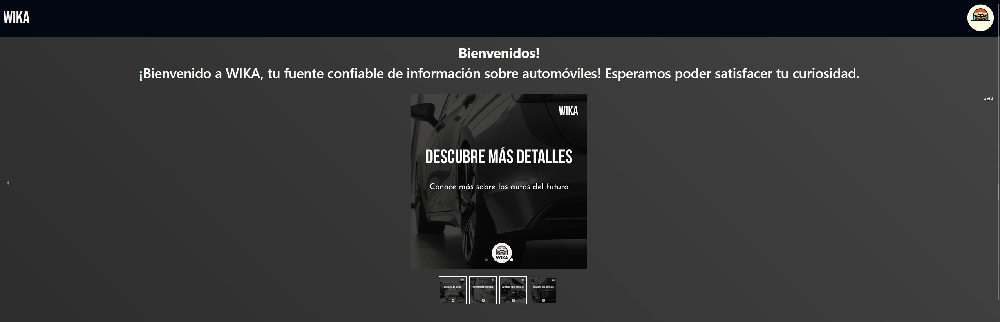
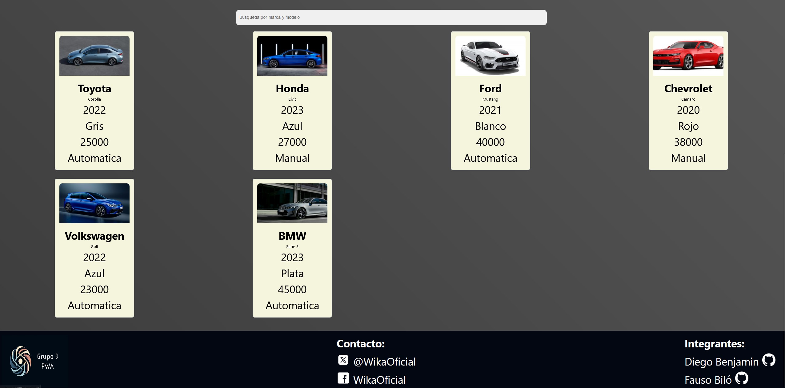
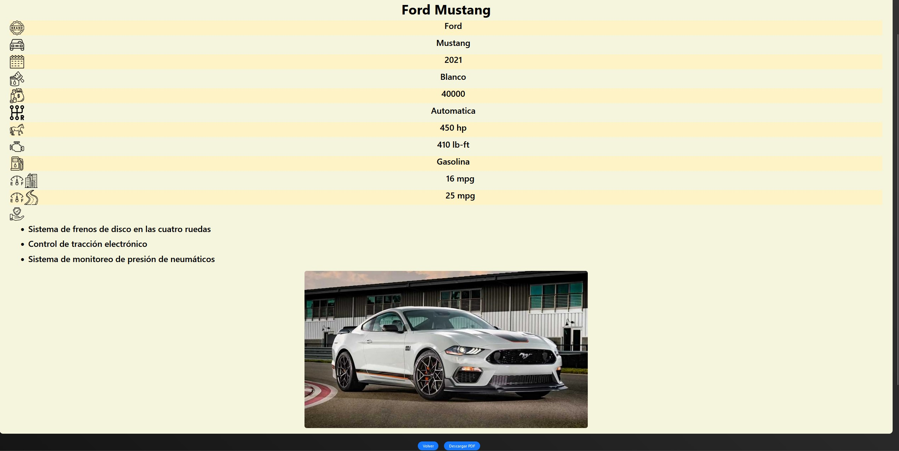
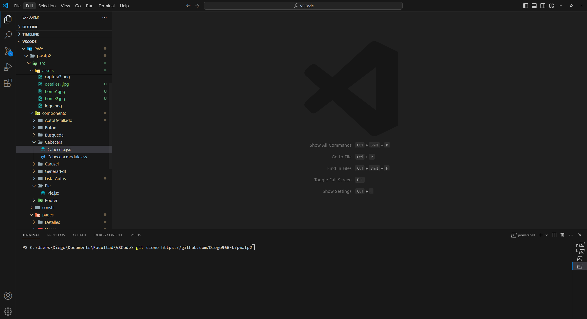
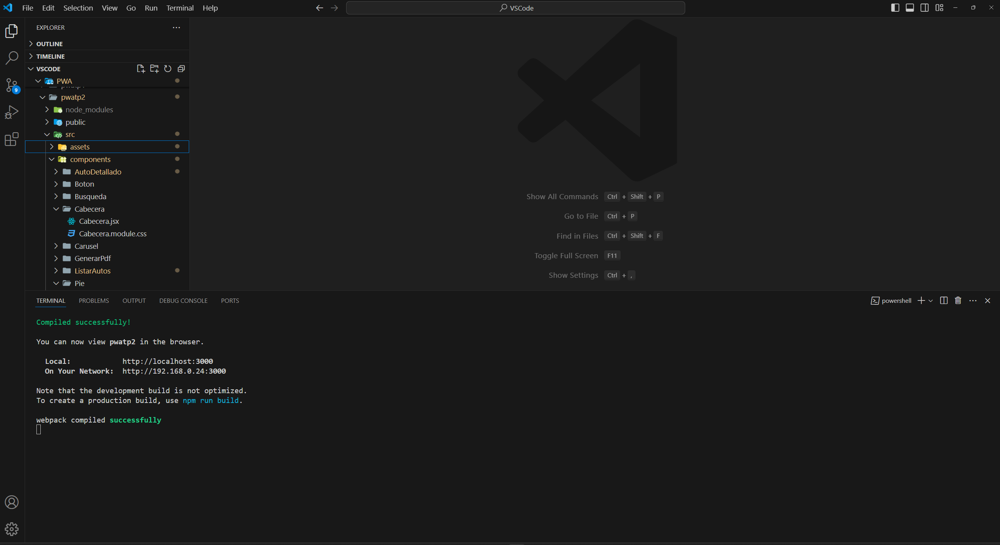
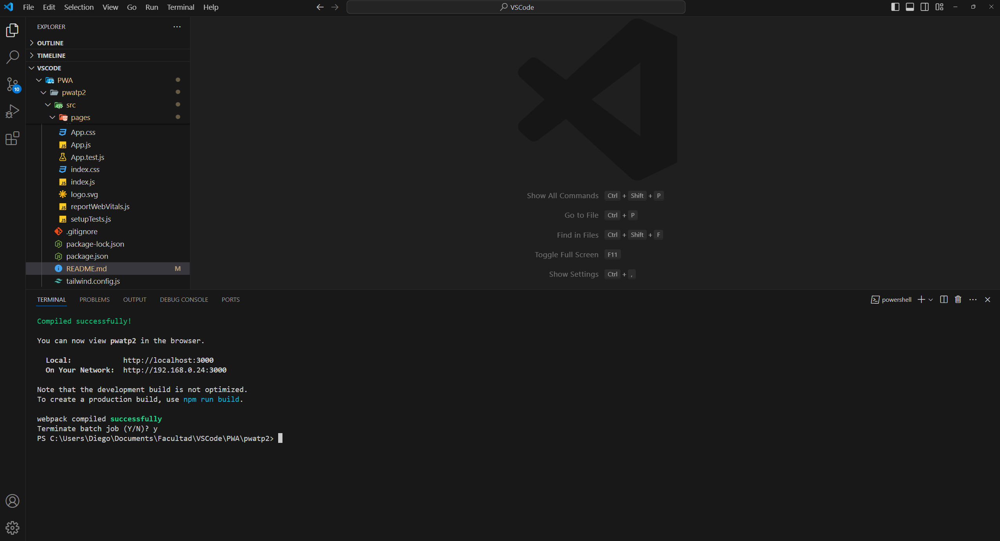

# TP 2 PWA


Esta es una aplicacion web desarrollada en React donde fue diseañada una home page
que va a mostrar varias cards con informacion de autos (la cual es sacada de un archivo .json), 
luego se puede seleccionar una para mostrar mas detalles del auto.

Fue diseñado como Trabajo practico numero 2 de la materia
"Programacion Web Avanzada" de la carrera universitaria en
desarrollo web, en la facultad nacional del comahue (UNCO).

## Home




## Página de detalles



## Instalación
1. Instala Node.js
    - Si no tenes instalado node.js descargalo de este [link](https://nodejs.org/en/download).

1. Clona el repositorio:
    - Usa este comando en la terminal de tu IDE: ```git clone https://github.com/Diego966-b/pwatp2.git```.



2. Entrar a la direccion desde la terminal.
    - Utiliza el comando "cd" hasta entrar a la carpeta que contiene al repositorio, luego escribe ```cd pwatp2```.

3. Instalar las dependencias.
    - Utiliza el comando ```npm install``` para que se instalen las dependencias requeridas del proyecto.

4. Iniciar la aplicacion.
    - Utiliza el comando ```npm start``` para  comenzar la aplicación.



5. Para cerrar la app.
    - Toca la tecla ctrl + c y luego la tecla "s".



## Miembros del Grupo

- Fausto Ignacio Biló - FAI 3616 - faustobilo47@gmail.com.
- Diego Benjamin - FAI 3002 - diego.benjamin@est.fi.uncoma.edu.ar.